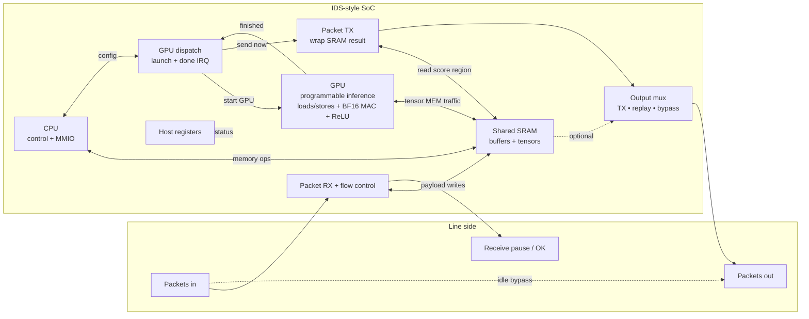

# Streaming inference accelerator — architecture (for slides / classmates)

This version uses familiar words (**CPU**, **GPU**, **SRAM**) and avoids **our internal Verilog signal names**. RTL mapping stays in the appendix for lab/debug.

---

## One-sentence story

**Packets arrive → payload lands in on-chip SRAM → the GPU runs the neural net → a transmit block wraps the result into an outbound packet** (or traffic bypasses when idle).

---

## What we mean by **CPU** vs **GPU** here

| Block | Role | Think of it as… |
|-------|------|------------------|
| **CPU** | Runs **control software**: MMIO to FIFO regions, sequences host-visible setup, talks to the **launch unit** that starts the GPU with a **program counter + length**. Does **not** do heavy BF16 tensor math. | Small **ARM-like control core** attached to the same SRAM as the accelerator. |
| **GPU** | Runs **the inference kernel**: fetch/decode of **GPU instructions**, **loads/stores** to SRAM, **BF16 vector multiply–accumulate** (dot-product style), **ReLU** on packed lanes, then **halt**. This is our **programmable inference pipeline** — not an NVIDIA SM, but same *idea*: offload parallel numeric work from the CPU. | **Tiny programmable accelerator** with its own ISA and tensor-style ops. |

So: **“GPU”** = the block that executes **LW / MAC-style ops / ReLU / store** sequences you load into **GPU instruction memory**; **“CPU”** = orchestration and MMIO around it.

---

## Where **CUDA** fits (be precise so nobody calls it misleading)

**We are not claiming this FPGA runs NVIDIA CUDA binaries or CUDA kernels.**

What we *can* say honestly for the same audience:

| CUDA idea | Our equivalent (conceptual) |
|-----------|------------------------------|
| **Host launches a kernel** | Host (or CPU) writes config / dispatch; **launch unit** asserts **GPU start** with **base address + instruction count** (like “where the kernel starts” + “how many instructions to fetch”). |
| **Kernel code lives off-chip then gets loaded** | **GPU instruction memory** is loaded via registers / loader — same pattern as “upload kernel code,” just not `.cu` machine code. |
| **Threads run SIMD-ish math** | GPU executes **packed BF16 lane ops** (MAC + ReLU) suited for **CNN layers** built from MAC stacks + activations. |
| **CUDA runtime hides hardware** | **Future software layer** could expose a **CUDA-*like*** API (“launchInference(ptr, len, …)”); today it’s closer to **MMIO + programmed ISA**. |

**Slide-safe one-liner:**

> “Software model is **CUDA-inspired**: host launches a bounded GPU program with base + length and tensor-style BF16 ops — **not** binary-compatible with NVIDIA CUDA.”

---

## Why this design is different (still plain language)

| Idea | What it means |
|------|----------------|
| **Compute next to the network** | Inference runs **after receive** and **before transmit**, instead of sending everything to host DRAM + server GPU first. |
| **CPU + GPU share one SRAM** | One fast pool holds **packet payload**, **features**, **weights**, and **outputs**; fewer copies than CPU→DRAM→GPU→DRAM. |
| **Separate RX vs TX hardware** | **Receive path** captures packets and can **pause input** until the GPU finishes. **Transmit path** only **formats** a **result packet** after completion — it doesn’t replace GPU stores; results are **stored first**, then **read back for transmit**. |
| **Host visibility** | **Register file** on the host side for setup, status, and optional telemetry — normal NIC offload story. |

---

## Physical vs logical memory (one slide bullet)

Implementation uses **one main SRAM macro** with multiple logical regions (input buffer, tensors, output near transmit readback). Draw **RX → SRAM → GPU → SRAM → TX** even though it’s **one physical bank**.

---

## ASCII diagram — CPU / GPU wording

```
      Incoming packets                              Outgoing packets
           │                                              ▲
           ▼                                              │
      ┌─────────────┐         ┌─────────────────────────────┴───────────────┐
      │ PACKET RX   │ writes  │     SHARED ON-CHIP SRAM                       │
      │ + flow ctrl │────────►│  payload • tensors • scores • GPU IMEM etc.    │
      └─────────────┘         └───▲───────────────────────────▲────────────────┘
             ▲                   │ loads/stores              │ TX reads results
             │ pause until done │                           │
      ┌──────┴────────┐   ┌─────┴──────┐   ┌────────────────┴─────────────────┐
      │     CPU       │   │    GPU      │   │         PACKET TX               │
      │  control core │◄─►│ inference   │   │ formats NF-style egress after   │
      │ MMIO / FIFO   │   │ pipeline    │   │ GPU done (header / payload / end)│
      └───────┬───────┘   └─────────────┘   └─────────────────┬───────────────┘
              │                                                 │
              ▼                                                 │
      ┌───────────────┐   BF16 vector MAC + ReLU inside GPU    │
      │ LAUNCH / IRQ  │────────────────────────────────────────►│ completion → TX
      │ (GPU dispatch)│                                           │
      └───────────────┘

      ┌─────────────────────────────────────────────────────────────────────┐
      │ OUTPUT MUX: accelerator TX vs optional FIFO replay vs wire bypass       │
      └─────────────────────────────────────────────────────────────────────┘

      HOST (BAR): REGISTER FILE ↔ configure CPU/GPU / read status
```

---

## Mermaid — paste into slide tools



---

## Slide captions you can reuse

1. **CPU orchestrates, GPU computes** — same separation students know from heterogeneous systems, shrunk onto one NIC-scale datapath.

2. **CUDA-inspired, not CUDA-binary-compatible** — launch semantics + programmable kernels + BF16 tensor ops; mapping to a familiar programming model without claiming NVIDIA toolchain support.

3. **CNN-shaped hardware** — stacks of **MAC + ReLU** match multi-layer CNN building blocks.

---

## Appendix — RTL ↔ slide labels (internal / lab only)

| Slide label | RTL anchor |
|-------------|------------|
| Packet RX | `RX_FSM` |
| Shared SRAM | `gpu_fifo_mem` → `convertible_fifo` → `FIFO_72W256D` |
| CPU | `pipeline_pseudoARM` |
| GPU dispatch | `gpu_control_interface_2` |
| GPU | `pipeline_backup` (+ GPU decode / hazards / tensor path) |
| BF16 MAC + ReLU | `bf16_tensor_2`, `bf16_fma` |
| Packet TX | `tx_fsm` |
| Output mux | `ids` egress arbitration |
| Host registers | `generic_regs` / `ids.xml` |
