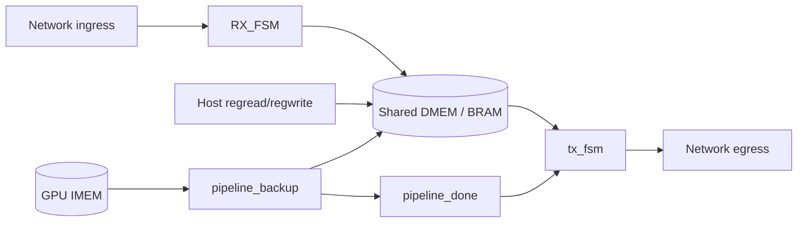

# GPU instructions and SoC architecture (lab9_tx)

This document explains how the **GPU inference pipeline** in `ids.v` is programmed, which **instructions** it understands, and how that ties to **packet RX**, **shared SRAM (DMEM)**, and **packet TX**. It is written for teammates bringing up simulation or the FPGA.

For slide-level block diagrams and CPU vs GPU roles, see `ARCHITECTURE_IDS_BLOCK_DIAGRAM.md`.

---

## End-to-end flow

1. **Ingress** — `RX_FSM` watches the IDS `in_*` stream (NetFPGA-style `in_ctrl` bytes). On end-of-packet it writes **`packet_word_count`** to DMEM byte **`0x00`** and stores each **payload** 64-bit word at **`0x10 + index`**.
2. **Launch** — Host software (or the ARM control path) loads **GPU IMEM**, then pulses **GPU start** with **PC** and **instruction count**.
3. **Execute** — `pipeline_backup` fetches that many words from IMEM, runs **scalar**, **vector-int**, and **BF16 tensor** ops, and **loads/stores** through the same **convertible FIFO / BRAM** as RX and host access (`gpu_fifo_mem` in `ids.v`).
4. **Done** — When fetch and pipeline drain finish, **`pipeline_done`** asserts. **`tx_fsm`** then reads a configured window from DMEM (base **`0xD0`**) and emits an egress packet: **`ctrl = FF`** (header), **`00`** (body beats), **`80`** on the last payload beat.

---

## Shared memory map (DMEM byte addresses)

All agents use **byte addresses** on an **8-bit** space. Each **64-bit line** is one index in the convertible FIFO (host and GPU see the same backing store).

| Byte range | Typical use |
|------------|-------------|
| **`0x00`** | RX metadata: low **8 bits** = **`packet_word_count`** (number of payload 64-bit words captured). Cleared to **0** by `tx_fsm` when a transmit completes. |
| **`0x10` …** | RX **payload** words (`0x10 + word_index`). CNN inputs are usually read from here with **`LD`**. |
| **`0xD0` …** | **TX result** window (`TX_OUT_BASE` in `tx_fsm.v`). GPU **`ST`** here; TX FSM reads from here for egress. |
| **`0xF0`–`0xF3`** | **ARM / `gpu_control_interface_2`** MMIO (not the IDS UDP register block): program base, length, dispatch, IRQ ack. |
| **`0xF8`** (scratch) | Used by `nf_ids_rxtx_check.pl` **`hostdmem`** self-test only. |

**IMEM** is separate: **9-bit** word index (`0` … `0x1FF`), loaded via the **`imem`** software register and **`input_type` bit 0**.

---

## Host programming model (IDS software registers)

Register layout is in `ids.xml`. Within the IDS block, **word index** `0` … `5` are software; **`+6` … `+9`** are hardware readback (`dmem_out_lo/hi`, `imem_out`, `tensor_out`). Exact **PCI/UDP addresses** come from your project’s generated **`reg_defines_*.h`** (word index + block base).

| SW index | Name | Role |
|----------|------|------|
| 0 | `dmem_in_hi` | Host DMEM write data `[63:32]` |
| 1 | `dmem_in_lo` | Host DMEM write data `[31:0]` |
| 2 | `imem` | IMEM write data (32-bit instruction word) |
| 3 | `address` | IMEM index **or** DMEM byte address **or** GPU start fields (see below) |
| 4 | `input_type` | One-cycle **strobe** masks (pulse high, then write **0**) |
| 5 | `cpu_ctrl` | Optional ARM **`cpu_start`** pulse on bit **0** rising edge |

### `input_type` strobe bits (`ids.v`)

| Bit | Mask | Action |
|-----|------|--------|
| 0 | `0x1` | Write **`imem`** to IMEM at `address[8:0]` |
| 1 | `0x2` | Write **`{dmem_in_hi, dmem_in_lo}`** to DMEM at `address[7:0]` |
| 2 | `0x4` | **Host read** DMEM at `address[7:0]`; result latched into **`dmem_out_lo/hi`** (read those HW words after ~1 BRAM cycle) |
| 3 | `0x8` | **Software GPU start** (rising edge on bit 3): use `address[7:0]` = **PC**, `address[15:8]` = **instruction count** |
| 4 | `0x10` | Host read IMEM at `address[8:0]` → **`imem_out`** |

**Typical host sequence**

1. For each IMEM word: write `address` = index, write `imem` = opcode, pulse bit **0**, clear `input_type`.
2. Optional: preload DMEM with pulse bit **1**.
3. Write `address` = `{len[15:8], pc[7:0]}`, pulse bit **3** once, clear `input_type`.
4. After GPU work, pulse bit **2** and read hardware **`dmem_out_*`** for host visibility.

`nf_ids_rxtx_check.pl` automates this with **`--reg-flavor netfpga`** (`regwrite` / `regread`). Modes: **`hostdmem`** (BRAM round-trip), **`rx`** (poll `DMEM[0x00]`), **`tx`** (minimal GPU + start), **`both`**.

---

## Starting the GPU

### Path A — Software (`input_type` bit 3)

On a **rising edge** of `input_type[3]`, `ids.v` merges **`gpu_start_sw_pulse`** with the ARM launch line. For that cycle, **`address[7:0]`** = IMEM **PC** and **`address[15:8]`** = **`bram_length`** (number of instructions to fetch). `pipeline_backup` latches PC/end on that pulse and fetches **`bram_inst_addr` … `bram_inst_addr + length - 1`**.

### Path B — ARM (`gpu_control_interface_2`)

CPU stores at DMEM **`0xF0`** (base), **`0xF1`** (length), then writes **`0xF2`** to **dispatch**. The interface asserts **`gpu_start`** for one cycle and drives **`bram_inst_addr` / `bram_length`**. When **`pipeline_done`** is seen, state moves to **DONE** and **`gpu_irq`** can be cleared at **`0xF3`**.

Writes to addresses in **`[cfg_base, cfg_base + length)`** can also decode as **IMEM loads** while the window is configured.

### `pipeline_done`

Asserted when **`bram_length` ≠ 0**, all instructions in the window have been **issued**, fetch is inactive, and the **post-fetch drain** counter has reached zero (`pipeline_backup.v`). **`tx_fsm`** waits on **`pipeline_done`**, then packetizes from **`0xD0`**.

---

## Instruction word format (32 bits)

Decoded in `decode.v` / `decode_gpu.v` (same opcode map). **`pipeline_backup`** uses **`decode`**.

| Field | Bits | Meaning |
|-------|------|---------|
| **Format** | `[31:30]` | `00` = R-type, `01` = I-type, `10` = B-type |
| **Opcode** | `[31:26]` | See table below |
| **R-type** | `rd[25:21]`, `rs1[20:16]`, `rs2[15:11]` | Scalar / tensor register operands |
| **I-type** | `rd`, `rs1`, **`imm14[15:2]`**, `width[1:0]` | Immediate for ALU / memory effective address |
| **B-type** | `rs1`, `rs2`, **`offset[15:0]`** (low 9 bits used) | Conditional branch |

**Register file:** 64-bit **`R0`–`R31`** (`registerFile64`).

**Memory effective address (scalar `LD` / `ST`):** In EX, the scalar ALU computes **`rs1 + sign_extend(imm14)`**; MEM uses **`result[7:0]`** as the **DMEM byte address** (`pipeline_backup.v`). **`LD`** writes the loaded 64-bit line to **`rd`**; **`ST`** stores **`rs2`** to that address.

**Tensor ops** use **`bf16_tensor_2`**: packed **BF16** lanes in 64-bit registers; **`VMAC_BF16`** can stall the front end via the hazard unit until the tensor unit is ready.

---

## Opcode reference

| Opcode (hex) | Mnemonic (typical) | Format | Execution unit | Notes |
|--------------|-------------------|--------|----------------|-------|
| `0x00` | NOP | R | — | No register write |
| `0x01` | ADD | R | Scalar ALU | |
| `0x02` | SUB | R | Scalar ALU | |
| `0x03` | CVT | R | Scalar ALU | |
| `0x04` | VADD_I16 | R | Vector int | |
| `0x05` | VSUB_I16 | R | Vector int | |
| `0x06` | VADD_BF16 | R | BF16 tensor | |
| `0x07` | VSUB_BF16 | R | BF16 tensor | |
| `0x08` | VMUL_BF16 | R | BF16 tensor | |
| `0x09` | VMAC_BF16 | R | BF16 tensor | MAC / dot-style; may stall fetch |
| `0x0A` | VRELU_BF16 | R | BF16 tensor | ReLU on packed lanes |
| `0x0B` | HALT | R | — | Stops meaningful work; still counts in fetch window if in IMEM |
| `0x0C` | VMUL_I16 | R | Vector int | |
| `0x11` | ADDI | I | Scalar ALU | |
| `0x12` | LD | I | MEM | Load 64-bit line from DMEM |
| `0x13` | ST | I | MEM | Store `rs2` to DMEM |
| `0x19` | MOVI | I | Scalar ALU | Immediate into `rd` |
| `0x25` | BEQ | B | Branch | If `rs1 == rs2`, PC += offset |
| `0x26` | BLT | B | Branch | Signed less than |
| `0x27` | BGT | B | Branch | Signed greater than |

**Hardware readback:** `tensor_out` (IDS HW register) can reflect **`tensor_out_intercept`** from the EX tensor path for debug / telemetry.

---

## Example programs (from testbenches)

### Minimal TX smoke (`nf_ids_rxtx_check.pl`, `tb_udp_packet_user_data_path.v`)

| IMEM | Encoding | Effect |
|------|----------|--------|
| 0 | `0x48200040` | **LD** `R1` from DMEM byte **`0x10`** |
| 1–3 | `0x00000000` | NOP |
| 4 | `0x4C200340` | **ST** `R1` to byte **`0xD0`** |
| 5 | `0x2C000000` | **HALT** |

Host preloads **`0x10`** (e.g. test pattern), starts with **PC=0, len=6**. After **`pipeline_done`**, TX should emit **`FF` / payload / `80`** with data from **`0xD0`**.

### CNN-style MAC + ReLU (`tb_ann_neuron.v`)

After RX fills **`0x10`–`0x17`**, a longer kernel uses multiple **`LD`**, four **`VMAC_BF16`**, **`VRELU_BF16`**, **`ST`** to the TX window, then **HALT**. See constants `LW_R1_10` … `ST_R10_90` in that file for exact encodings.

### Simulation shortcut

`tb_ids_rx_tx_soc.v` and `tb_user_data_path_rx_tx_soc.v` often **force `pipeline_done`** for one cycle instead of running the full IMEM program, while still checking **TX packetization** from data preloaded at **`0xD0`**.

---

## Egress packetization (`tx_fsm.v`)

- Waits in **IDLE** until **`pipeline_done`**.
- **Header beat:** `in_ctrl = 8'hFF`, data don’t care (zero in RTL).
- **Payload beats:** `in_ctrl = 8'h00`, data from **`port_b_dout`** at **`port_b_addr`** starting at **`0xD0`**.
- **Last payload beat:** `in_ctrl = 8'h80`.
- **Clear:** writes **0** to DMEM **`0x00`** (releases RX metadata for the next packet).

`ids.v` muxes **`tx_fsm`** beats ahead of passthrough / other TX sources on **`out_*`**.

---

## RTL modules (quick map)

| Module | Role |
|--------|------|
| `ids.v` | Top IDS: registers, RX/TX FSMs, `gpu_fifo_mem`, GPU + ARM pipelines, egress mux |
| `RX_FSM.v` | Ingress capture → DMEM |
| `tx_fsm.v` | `pipeline_done` → read DMEM → egress framing |
| `pipeline_backup.v` | **GPU** core (`gpu_Unit` in `ids.v`) |
| `pipeline_pseudoARM.v` | **CPU** control core (shared DMEM) |
| `gpu_control_interface_2.v` | ARM launch / IRQ / IMEM load window |
| `gpu_fifo_mem.v` | Arbiter for host, GPU, CPU, RX, TX clear on one BRAM |
| `decode.v` | Instruction decode (opcodes above) |
| `bf16_tensor_2.v` | BF16 vector unit |

---

## Bring-up order (recommended)

1. **`hostdmem`** — Host write/read of a known 64-bit pattern (script uses **`0xF8`**) before trusting RX polls.
2. **Simulation** — `tb_ids_rx_tx_soc` or `tb_user_data_path_rx_tx_soc` for RX + TX framing.
3. **Board RX** — UDP/iperf into the path that hits IDS; poll **`DMEM[0x00]`** only after step 1 passes.
4. **Board TX** — Minimal IMEM program + **`tcpdump`** on the real egress interface (not a placeholder name like `iface`).
5. **Full CNN** — Replace minimal kernel with MAC/ReLU sequence; compare egress bytes to sim golden.

**Note:** Register read behavior on the FPGA follows **whatever `generic_regs` (or equivalent) is in your synthesis project**, not necessarily the behavioral copy in this repo unless that file is in your bitfile build.

---

## Related files

- `ids.xml` — Register names and SW/HW order  
- `nf_ids_rxtx_check.pl` — Host automation  
- `ARCHITECTURE_IDS_BLOCK_DIAGRAM.md` — Higher-level architecture narrative  
- `tb_ann_neuron.v`, `tb_ids_rx_tx_soc.v`, `tb_user_data_path_rx_tx_soc.v` — Reference stimulus and expected TX framing
